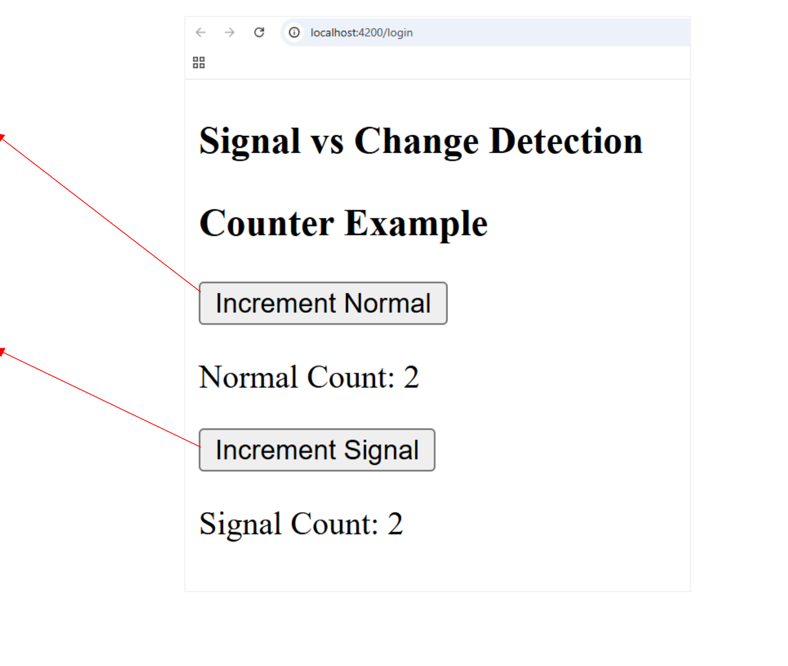
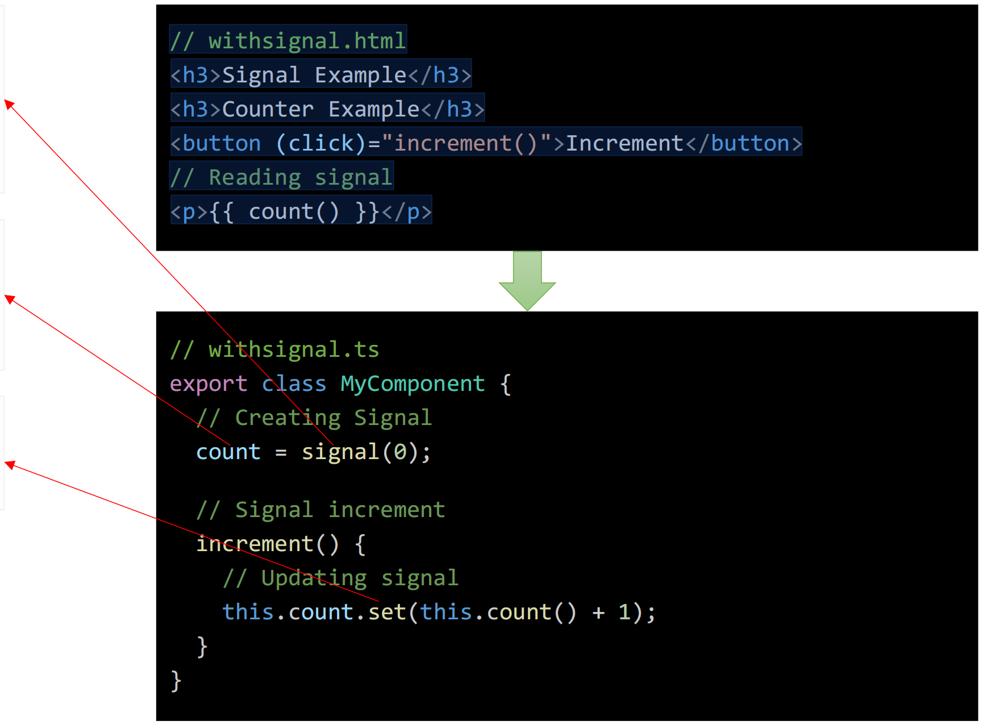
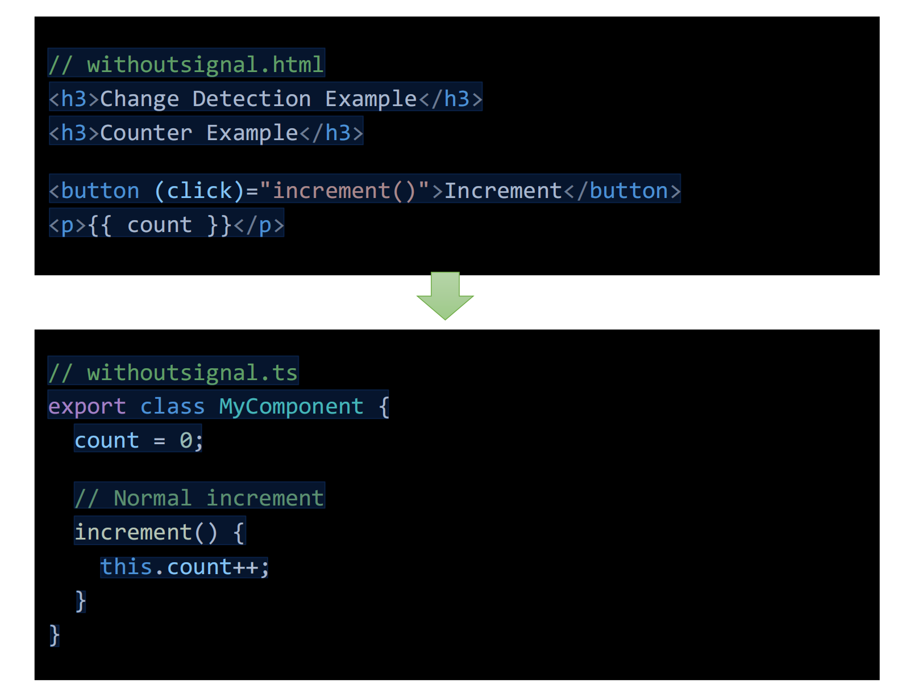

# Signals trong Angular

### Q1. Signals là gì? Sự khác biệt cốt lõi giữa Signals và Change Detection truyền thống?

**Trả lời:**
Để hiểu rõ giá trị của Signals, trước tiên chúng ta cần nhắc lại về **Change Detection**:

- **Change Detection** là quá trình Angular kiểm tra toàn bộ ứng dụng để phát hiện sự thay đổi dữ liệu, từ đó cập nhật lại giao diện (UI).
- **Nhược điểm:** Cơ chế Change Detection truyền thống (dựa vào Zone.js) sẽ quét và kiểm tra **rất nhiều bindings (ràng buộc dữ liệu)** trên giao diện, kể cả những nơi không hề có sự thay đổi. Điều này có thể gây giảm hiệu năng.

**Ngược lại, Signals ra đời để giải quyết vấn đề trên:**

- **Signal** là một giá trị mang tính phản ứng (reactive value). Điểm mạnh nhất của Signal là khi giá trị của nó thay đổi, nó sẽ **tự động chỉ cập nhật chính xác khu vực UI** đang sử dụng giá trị đó (surgical updates), giúp tối ưu hóa hiệu năng một cách triệt để.



### Q2. Cách triển khai (Implement) Signals trong Angular như thế nào?

**Trả lời:**
Để sử dụng Signals, chúng ta thực hiện 3 bước cơ bản: Khởi tạo, Đọc giá trị và Cập nhật giá trị.

**1. Khởi tạo Signal:**
`signal()` là một hàm trong Angular dùng để tạo ra một giá trị phản ứng (Reactive value). Hàm này nhận vào một giá trị khởi tạo (initial value) và trả về một đối tượng Signal.

```typescript
import { Component, signal } from '@angular/core';

@Component({
  // ...
})
export class MyComponent {
  // Creating Signal
  count = signal(0); 
}
```

**2. Đọc giá trị của Signal:**
Để lấy giá trị hiện tại của Signal (cả trong file `.ts` lẫn trên giao diện `.html`), chúng ta bắt buộc phải gọi nó như một hàm (thêm dấu ngoặc đơn `()`).

```html
<!-- withsignal.html -->
<h3>Signal Example - Counter</h3>

<!-- Reading signal -->
<p>Count: {{ count() }}</p>
<button (click)="increment()">Increment</button>
```

**3. Cập nhật giá trị của Signal:**
Signals cung cấp sẵn các phương thức để thay đổi trạng thái của nó một cách an toàn:

- **`set()`**: Dùng để gán một giá trị mới hoàn toàn.
- **`update()`** *(Bổ sung)*: Dùng để tính toán giá trị mới dựa trên giá trị hiện tại.

```typescript
export class MyComponent {
  count = signal(0);
  
  increment() {
    // Cách 1: Sử dụng set() - Cập nhật giá trị
    this.count.set(this.count() + 1);

    // Cách 2: Sử dụng update() - Khuyên dùng khi tính toán phụ thuộc vào giá trị cũ
    // this.count.update(currentValue => currentValue + 1);
  }
}
```

> **Tóm lại:** Signal là một giá trị reactive, nó theo dõi xem ai đang "đọc" nó. Khi bạn gọi `set()` hoặc `update()`, Signal sẽ thông báo chính xác cho phần UI đó (ở đây là thẻ `<p>`) tự động render lại, bỏ qua hoàn toàn các nơi khác không liên quan.


### Q3. Cách triển khai Component theo Change Detection truyền thống (không dùng Signals) như thế nào?

**Trả lời:**
Trước khi có Signals, Angular mặc định sử dụng cơ chế Change Detection thông qua `Zone.js` để tự động phát hiện các sự kiện (click, HTTP request, setTimeout...) và cập nhật lại giao diện.

Cách triển khai dựa vào việc khai báo và gán giá trị cho các thuộc tính (properties) thông thường:

```typescript
// withoutsignal.ts
import { Component } from '@angular/core';

@Component({
  // ...
})
export class MyComponent {
  count = 0;
  
  // Normal increment
  increment() {
    this.count++;
  }
}
```

```html
<!-- withoutsignal.html -->
<h3>Change Detection Example</h3>
<h3>Counter Example</h3>

<button (click)="increment()">Increment</button>
<p>{{ count }}</p>
```

> **So sánh hiệu năng:** Trong cách tiếp cận này, mỗi khi bạn nhấn nút `Increment`, quá trình Change Detection sẽ diễn ra. Nó sẽ đi kiểm tra **rất nhiều bindings** trên toàn bộ component tree (kể cả những nơi không hề thay đổi) để đảm bảo dữ liệu được đồng bộ với UI. Điều này cồng kềnh và tốn kém hơn nhiều so với việc chỉ cập nhật đúng 1 chỗ như Signals.


---

### Q4. Signals và Observables (RxJS) khác nhau như thế nào? Khi nào dùng cái nào?

**Trả lời:**
❖ **Observables (RxJS)**: 
- Là những luồng dữ liệu (Data Streams) phát ra theo thời gian.
- **Rất tuyệt vời cho việc quản lý Event (sự kiện)** (như click liên tục, typeahead search) và xử lý dữ liệu bất đồng bộ phức tạp (HTTP Requests, WebSockets).

❖ **Signals**:
- Là một hộp chứa giá trị (Value Container) có khả năng thông báo khi giá trị thay đổi.
- **Rất tuyệt vời cho việc quản lý Application State (Trạng thái ứng dụng)** (như đóng mở sidebar, giỏ hàng, user login status) vì nó luôn giữ một giá trị đồng bộ và render UI cực kỳ tối ưu.

---

### Q5. Làm thế nào để chuyển đổi từ Signal sang Observable?

**Trả lời:**
Angular cung cấp hàm `toObservable` từ `@angular/core/rxjs-interop` để chuyển đổi một Signal thành một Observable. Điều này rất hữu ích khi bạn có một State (Signal) và muốn sử dụng các toán tử mạnh mẽ của RxJS (như `switchMap`, `debounceTime`) lên nó.

**Ví dụ:**
```typescript
import { Component, signal } from '@angular/core';
import { toObservable } from '@angular/core/rxjs-interop';

@Component({ ... })
export class AppComponent {
  clickCount = signal(0);
  
  // Chuyển Signal thành Observable
  clickCount$ = toObservable(this.clickCount);
}
```

---

### Q6. Làm thế nào để chuyển đổi từ Observable sang Signal?

**Trả lời:**
Ngược lại, Angular cung cấp hàm `toSignal` để biến một luồng Observable thành một Signal. Điều này giúp lấy dữ liệu từ RxJS (như HTTP Response hoặc Interval) và hiển thị lên giao diện theo chuẩn Signals mới mà không cần dùng `async` pipe.

**Ví dụ:**
```typescript
import { Component } from '@angular/core';
import { interval } from 'rxjs';
import { toSignal } from '@angular/core/rxjs-interop';

@Component({ ... })
export class AppComponent {
  interval$ = interval(1000); // Phát ra 0, 1, 2... mỗi giây
  
  // Chuyển Observable thành Signal, yêu cầu cung cấp giá trị ban đầu (initialValue)
  intervalSignal = toSignal(this.interval$, { initialValue: 0 });
}
```
