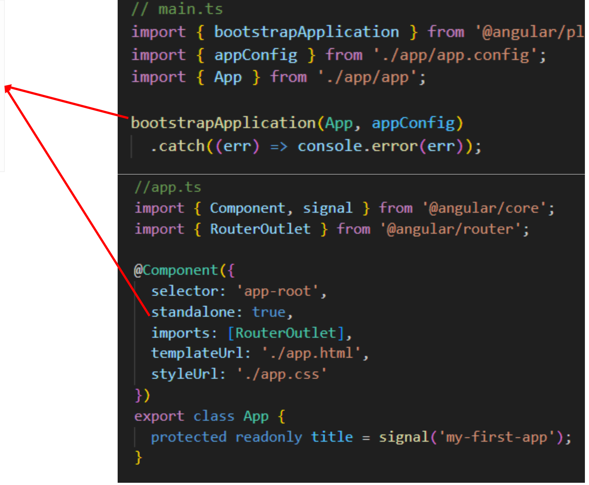
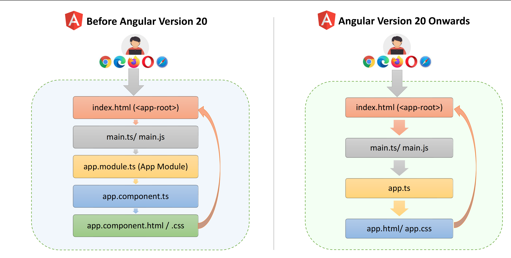

# Standalone Architecture

### Q1. What is Standalone Architecture? Difference btw modular and standalone architecture?

**Trả lời:**
- **Standalone Architecture (Kiến trúc độc lập):** Là kiến trúc trong Angular cho phép các components (cũng như directives, pipes) có thể hoạt động độc lập và tự quản lý các dependencies của riêng nó, mà không cần phải khai báo bên trong một `NgModule`.

- **Sự khác biệt so với Module-Based Architecture:**
  - **Module-Based:** Ứng dụng được cấu trúc xoay quanh các modules (`NgModule`). Các component không thể đứng một mình mà bắt buộc phải được khai báo (declare) và quản lý thông qua một module nào đó. Bạn không thể sử dụng component một cách trực tiếp nếu chưa import module chứa nó.
  
    

  - **Standalone:** Loại bỏ sự phụ thuộc vào `NgModule` (giảm boilerplate code). Component có thể tự đứng vững, tự import trực tiếp những gì nó cần (các component khác, pipes, directives, services), giúp cấu trúc dự án đơn giản, nhẹ nhàng và dễ tiếp cận hơn.

    

### Q2. Những ưu điểm (Advantages) của Standalone Architecture là gì?

**Trả lời:**
1. **Less boilerplate (Giảm thiểu mã thừa):** Không còn cần phải viết các file cấu hình `NgModule` dài dòng phức tạp.
2. **Simpler structure (Cấu trúc đơn giản hơn):** Không cần tạo thêm file module phụ trợ, dự án trở nên rất gọn gàng.
3. **Faster development (Phát triển nhanh hơn):** Viết code ít hơn, tập trung vào logic component thay vì cấu hình, giúp tăng tốc quá trình làm việc.

### Q3. Standalone APIs trong Angular là gì?

**Trả lời:**
Standalone APIs là tập hợp các API (các tính năng) được Angular cung cấp nhằm hỗ trợ xây dựng ứng dụng theo kiến trúc Standalone (hoàn toàn không sử dụng modules). 

Một số ví dụ phổ biến bao gồm:
- Khai báo `standalone: true` bên trong decorator `@Component`.
- Hàm `bootstrapApplication()` dùng để khởi chạy ứng dụng gốc (thay thế cho `bootstrapModule`).
- Hàm `provideRouter()` dùng để thiết lập và khởi tạo routing ở cấp độ ứng dụng.

### Q4. Quá trình khởi chạy ứng dụng (Loading process) thay đổi ra sao trước và sau Angular 20?

**Trả lời:**
Sự thay đổi lớn nhất chính là việc loại bỏ hoàn toàn `AppModule` trong quá trình khởi chạy:

**1. Trước Angular 20 (Kiến trúc Module-Based):**
- Trình duyệt tải file `index.html` (nơi chứa thẻ placeholder `<app-root>`).
- Tải và thực thi file `main.ts` (hoặc `main.js`).
- `main.ts` gọi hàm khởi động **`app.module.ts`** (`AppModule`).
- `AppModule` tiếp tục khởi chạy component gốc là `app.component.ts`.
- `app.component.ts` kết hợp với `app.component.html / .css` để render giao diện ra lại thẻ `<app-root>`.

**2. Từ Angular 20 trở đi (Kiến trúc Standalone):**
- Trình duyệt tải file `index.html` (chứa thẻ `<app-root>`).
- Tải và thực thi file `main.ts`.
- `main.ts` khởi động **trực tiếp component gốc `app.ts`** thông qua hàm `bootstrapApplication()`.
- `app.ts` kết hợp với `app.html / app.css` để render giao diện ra thẳng thẻ `<app-root>` (bỏ qua hoàn toàn bước trung gian là Module).

### Q5. Cấu trúc thư mục (Folder Structure) và các file dự án thay đổi ra sao từ Angular 20?

**Trả lời:**
Kể từ Angular 20, cấu trúc thư mục của một dự án Angular mới được tối giản hóa rất nhiều so với trước đây nhờ việc áp dụng mặc định kiến trúc Standalone:

1. **Bỏ hoàn toàn các file Modules:** Các file như `app.module.ts` và `app-routing.module.ts` đã bị xóa bỏ hoàn toàn. Các cấu hình ứng dụng, Routing và các Providers giờ đây được gộp chung vào quản lý tại file **`app.config.ts`**.
2. **Hợp nhất file cấu hình TypeScript:** Các file `tsconfig.spec.json` và `tsconfig.app.json` trước đây nằm lẻ tẻ đã được hợp nhất và quản lý gọn gàng hơn bên trong một file duy nhất là **`tsconfig.json`**.
3. **Thư mục Public thay thế Assets:** Thư mục `src/assets/` (nơi lưu trữ hình ảnh, tài nguyên tĩnh) được đẩy ra ngoài thư mục gốc của dự án và đổi tên thành thư mục **`public/`**.
4. **Rút gọn tên file Component gốc:** Các file `app.component.ts`, `app.component.html`, `app.component.css` thường được Angular CLI rút gọn tên lại thành **`app.ts`**, **`app.html`**, **`app.css`**.

